# Documentación Funcional — Librería Blanco

> Recorrido completo de cada pantalla y flujo, con capturas reales tomadas contra producción (`https://libreriablanco.vercel.app`). Para el detalle técnico de arquitectura, esquema y patrones de código, ver [DOCUMENTACION_TECNICA.md](DOCUMENTACION_TECNICA.md).

## Índice

1. [Portal público — Compra sin login](#1-portal-público--compra-sin-login)
2. [Panel administrativo — Acceso](#2-panel-administrativo--acceso)
3. [Admin: Catálogo (Productos y Categorías)](#3-admin-catálogo-productos-y-categorías)
4. [Admin: Pedidos](#4-admin-pedidos)
5. [Admin: Clientes](#5-admin-clientes)
6. [Admin: Configuración del negocio](#6-admin-configuración-del-negocio)
7. [Admin: Usuarios y Roles](#7-admin-usuarios-y-roles)
8. [QA de diseño responsive](#8-qa-de-diseño-responsive)

---

## 1. Portal público — Compra sin login

### Home

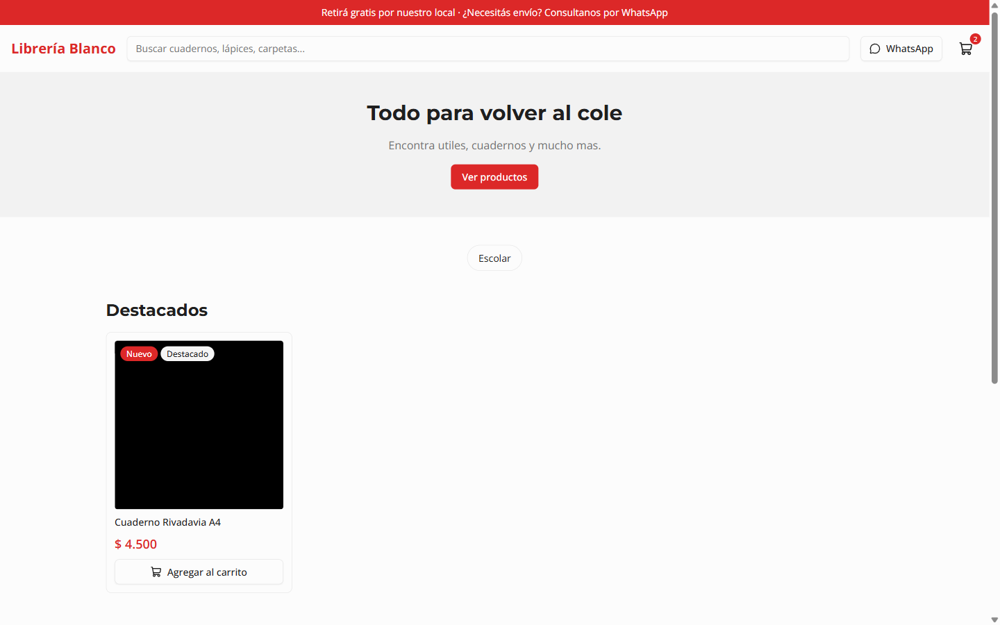

Hero con llamado a la acción ("Ver productos"), categorías destacadas, sección de Productos Destacados y Novedades. Barra superior con datos de retiro/envío y acceso directo a WhatsApp. El carrito persiste entre visitas (ícono con contador en el header).

### Listado de productos

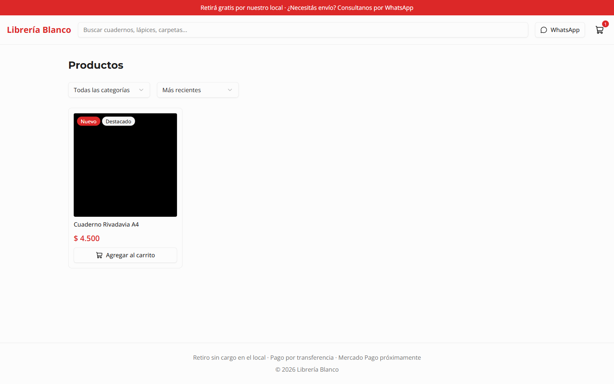

Filtro por categoría, orden (más recientes, etc.) y buscador de texto libre en el header. Cada card muestra badges de "Nuevo"/"Destacado" cuando corresponde, precio formateado en pesos argentinos, y botón directo de "Agregar al carrito" sin salir del listado.

### Ficha de producto

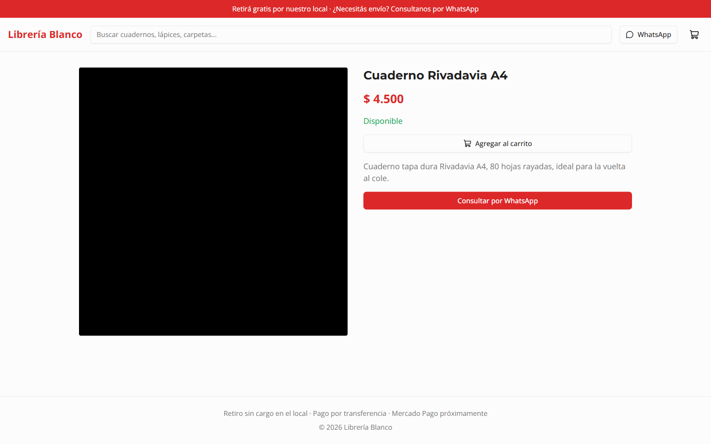

Nombre, precio, estado de disponibilidad, descripción, botón "Agregar al carrito" y un link de "Consultar por WhatsApp" que abre un mensaje precompletado con el nombre del producto y su URL.

### Carrito

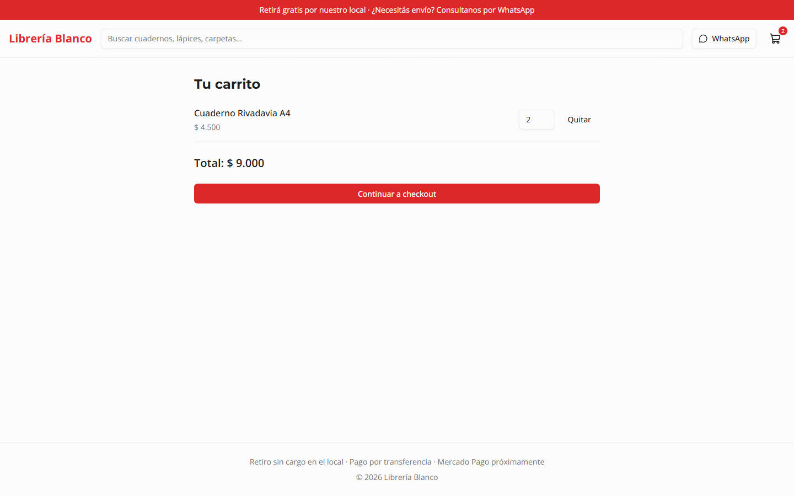

Estado del lado del cliente (persistido en el navegador). Permite ajustar cantidad o quitar productos, muestra el total y lleva a "Continuar a checkout".

### Checkout

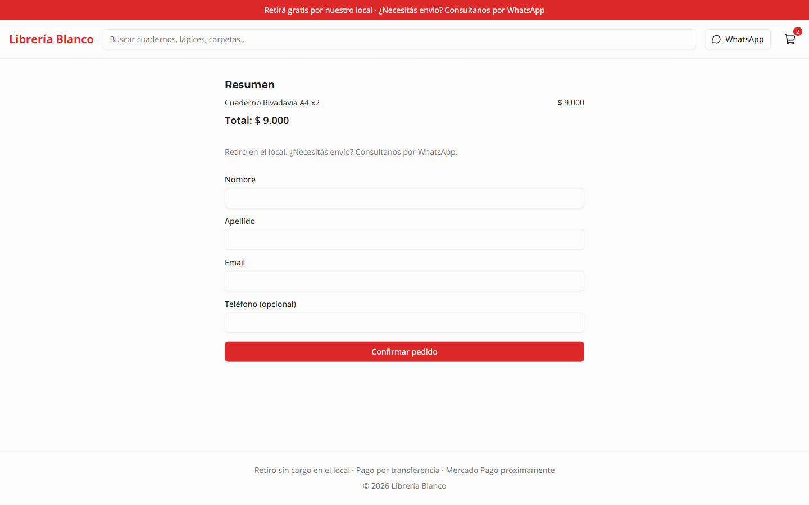

Formulario de datos del cliente (nombre, apellido, email, teléfono) para crear el pedido como invitado — **no requiere cuenta ni login**. Al confirmar, se crea el pedido con un número único (`LB-NNNN`) vía la función `create_guest_order`.

### Confirmación de compra

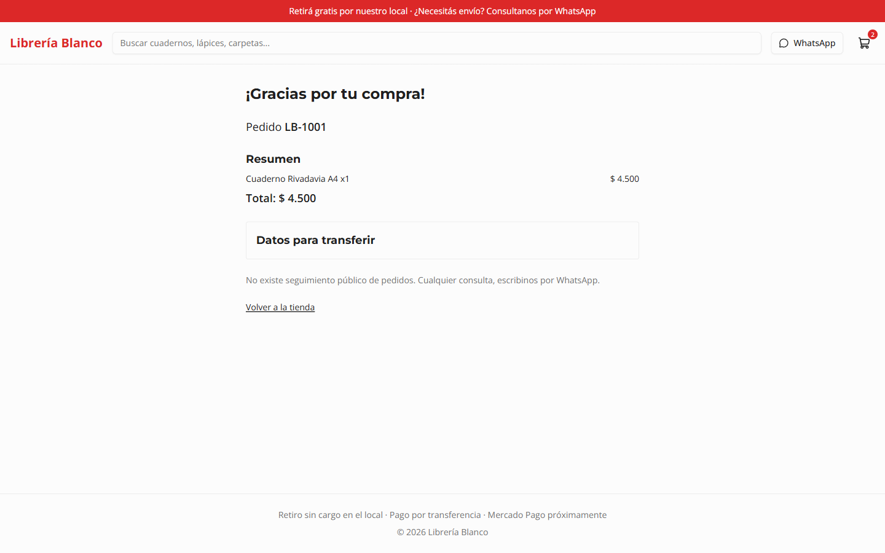

Página pública (accesible por el número de pedido, sin sesión) con el resumen del pedido, el total, y los datos de transferencia bancaria configurados por el negocio. Incluye un botón para enviar el comprobante por WhatsApp con un mensaje precompletado. No expone datos personales del cliente.

---

## 2. Panel administrativo — Acceso

### Login

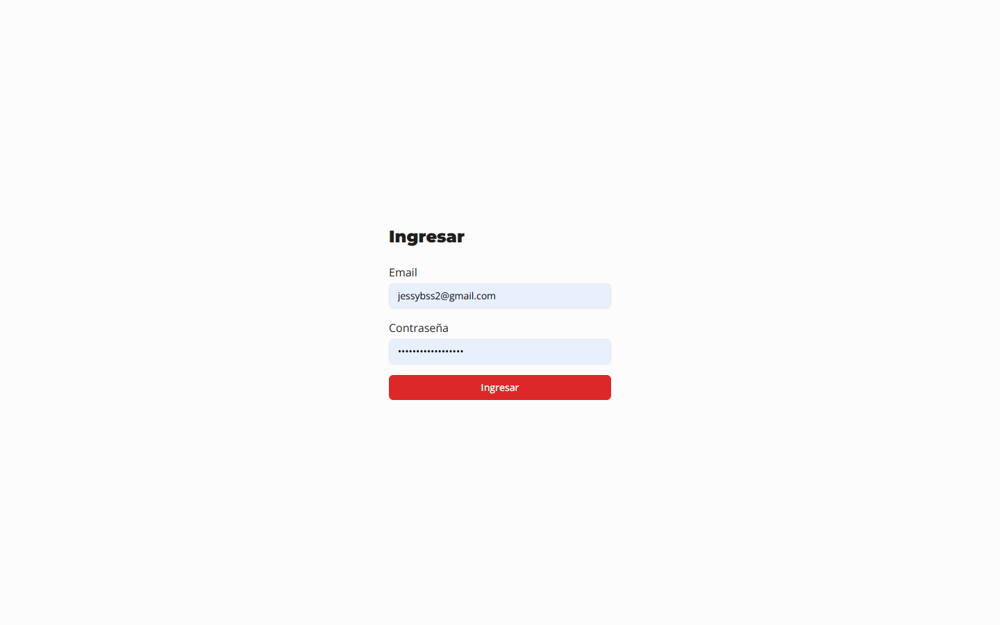

Autenticación vía Supabase Auth (email + contraseña). Solo usuarios con un `admin_profile` activo pueden acceder — un login exitoso de Supabase Auth sin perfil administrativo asociado redirige a una pantalla de "no autorizado".

### Dashboard

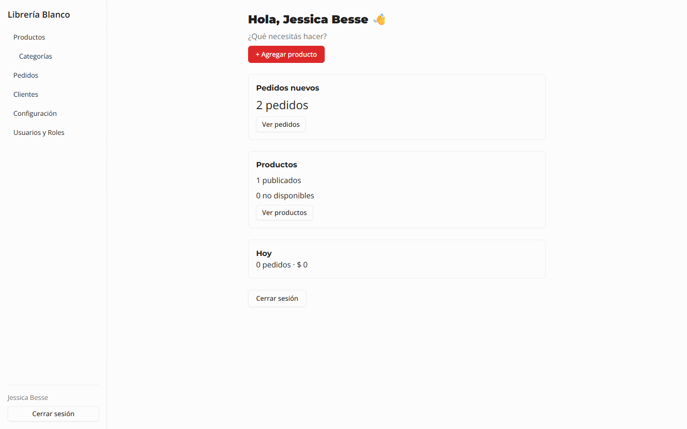

Resumen de pedidos nuevos, estado del catálogo (publicados/no disponibles) y ventas del día. El sidebar de navegación es el mismo en todas las pantallas del admin y muestra el nombre del usuario logueado.

---

## 3. Admin: Catálogo (Productos y Categorías)

### Listado de productos

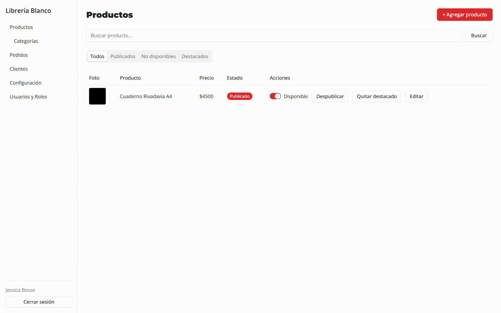

Gestión completa del catálogo: alta, edición, publicación/despublicación, disponibilidad, gestión de imágenes por producto (hasta 4, con una marcada como principal), costos y precios con cálculo de margen.

### Categorías

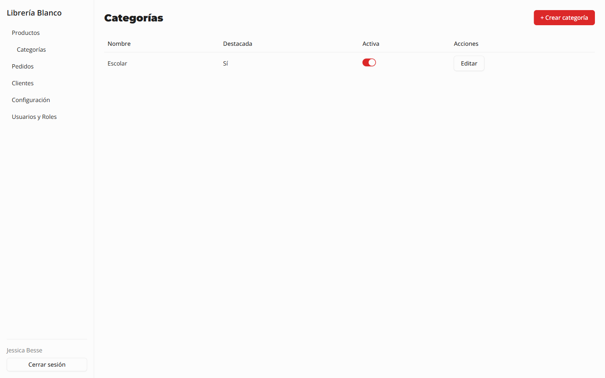

CRUD simple vía diálogo modal: nombre, si es destacada (aparece en la home) y si está activa.

---

## 4. Admin: Pedidos

### Listado de pedidos

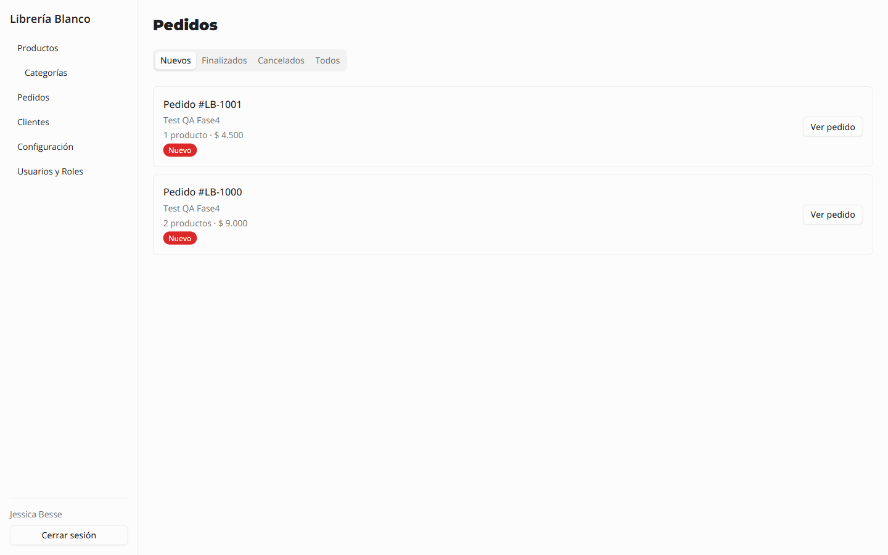

Organizado en tabs (Nuevos, Finalizados, Cancelados, Todos), cada pedido muestra número, cliente, cantidad de productos y total.

### Detalle de pedido

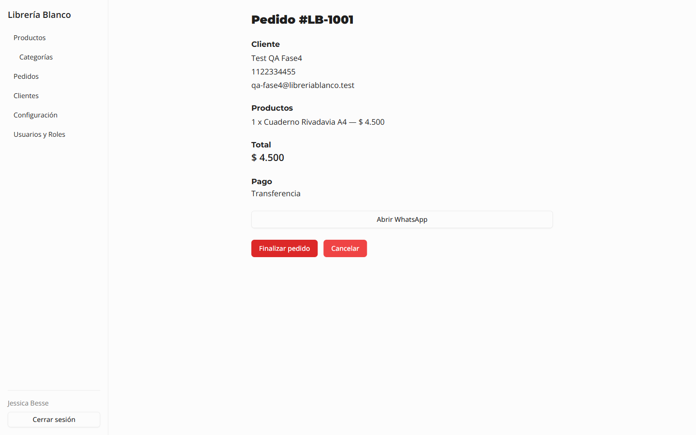

Ítems del pedido, datos del cliente, y acciones de cambio de estado (finalizar, cancelar) con confirmación antes de ejecutar.

---

## 5. Admin: Clientes

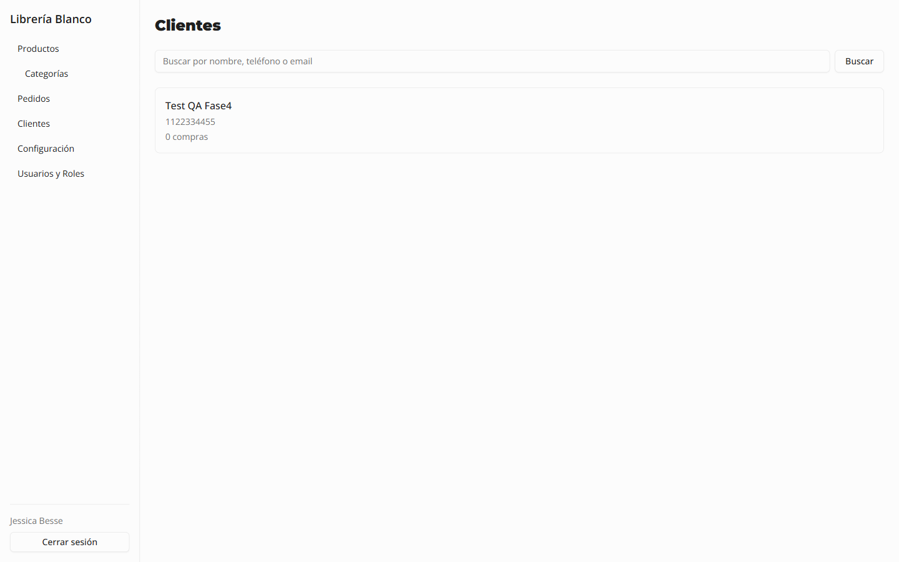

Listado con búsqueda por nombre/teléfono/email. El detalle de cada cliente (`/admin/clientes/[id]`) muestra su historial de compras. Los clientes se crean automáticamente al completar un checkout como invitado — no hay alta manual.

---

## 6. Admin: Configuración del negocio

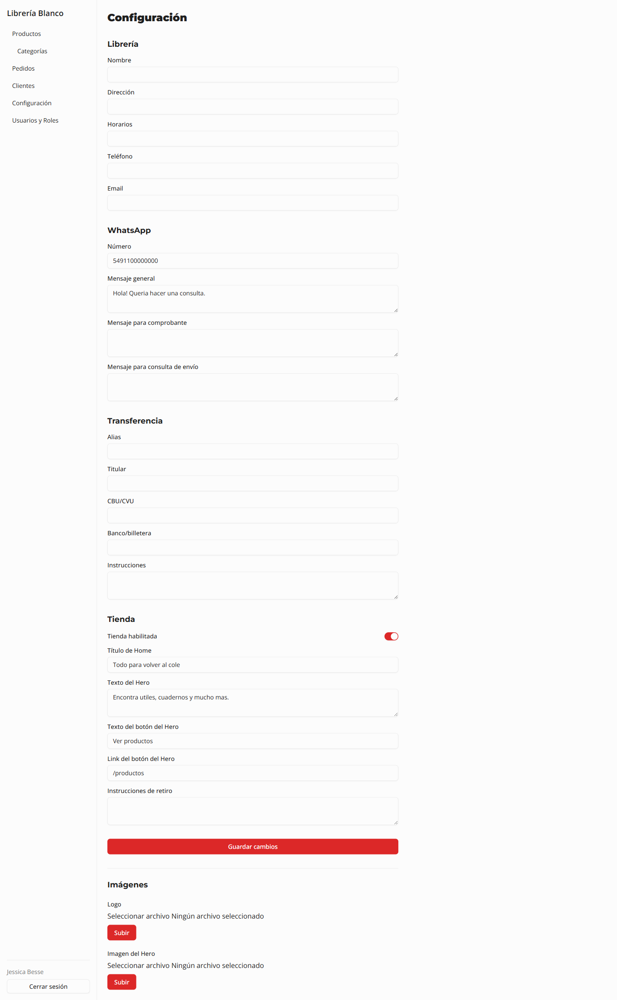

Cuatro secciones: **Librería** (nombre, dirección, horarios, contacto, logo), **WhatsApp** (número y plantillas de mensaje para consulta general, envío de comprobante y consulta de envío), **Transferencia** (alias, titular, CBU/CVU, banco, instrucciones) y **Tienda** (título y texto del hero de la home, imagen del hero). Los cambios impactan inmediatamente el portal público.

> Nota: en la captura de producción actual, la mayoría de estos campos todavía no fueron cargados por el negocio — es contenido real pendiente de carga, no un defecto de la pantalla.

---

## 7. Admin: Usuarios y Roles

Sección exclusiva de `SUPER_ADMIN` para gestionar quién puede acceder al panel y qué puede hacer cada quien.

### Listado de usuarios

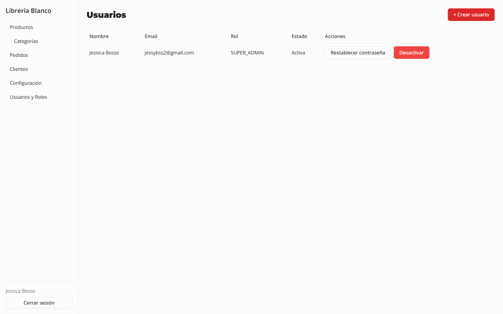

Cada fila muestra nombre, email (obtenido en tiempo real desde Supabase Auth), rol asignado y estado (activa/inactiva). El usuario `SUPER_ADMIN` no tiene botón "Editar" en su propia fila — su rol no se gestiona desde esta pantalla, solo se le puede restablecer la contraseña o desactivarlo (con un resguardo: el sistema nunca permite quedarse sin ningún `SUPER_ADMIN` activo).

### Crear usuario

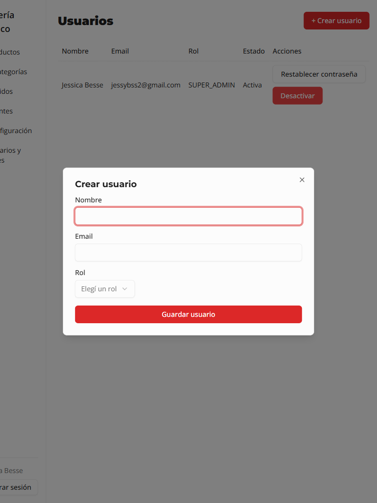

Al crear un usuario se genera una cuenta real en Supabase Auth con una **contraseña temporal** que se muestra una única vez en pantalla — hay que copiarla y pasársela a la persona, ya que no se puede volver a consultar (solo resetearla de nuevo si se pierde).

### Roles y matriz de permisos

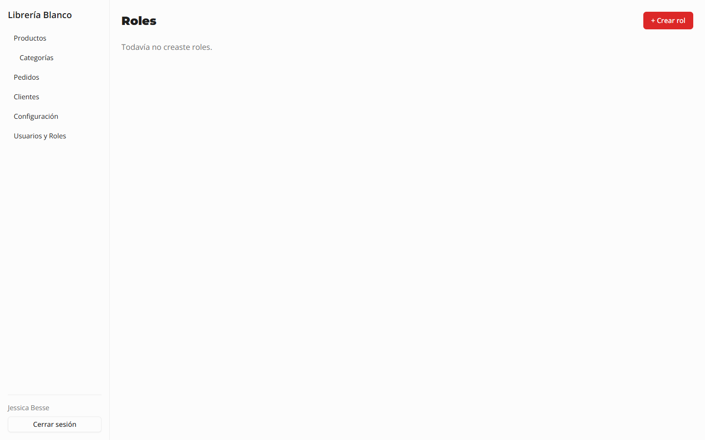

Lista de roles creados (excluye siempre a `SUPER_ADMIN`, que no se gestiona desde acá), con la cantidad de usuarios que tiene asignados cada uno — un rol no se puede borrar si todavía tiene usuarios asignados.

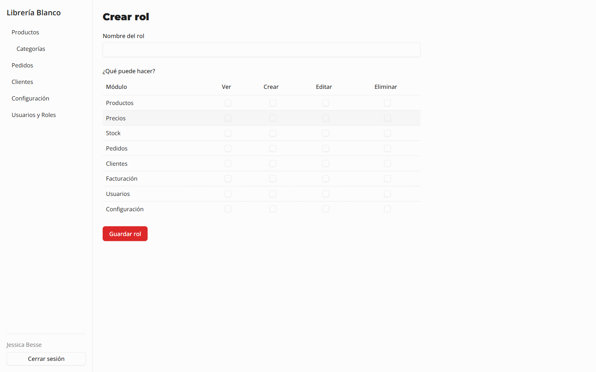

Al crear o editar un rol, una matriz visual de 8 módulos (Productos, Precios, Stock, Pedidos, Clientes, Facturación, Usuarios, Configuración) por 4 acciones (Ver, Crear, Editar, Eliminar) permite tildar exactamente qué puede hacer ese rol. Por ejemplo, un rol "Vendedora" podría tener solo Pedidos:Ver y Clientes:Ver, sin ningún otro permiso.

---

## 8. QA de diseño responsive

Se relevaron las pantallas principales en tres resoluciones contra producción: **escritorio** (1440px), **tablet** (768px) y **mobile** (375px, ancho típico de un iPhone). El diseño general responde bien y el panel de admin colapsa correctamente a un menú hamburguesa por debajo del breakpoint `md` de Tailwind (768px).

Se encontraron los siguientes puntos a mejorar, ninguno bloqueante para el uso del sitio pero sí relevantes para pulir la experiencia mobile:

| # | Dónde | Qué pasa | Impacto |
|---|---|---|---|
| 1 | Todas las fichas de producto, en cualquier resolución | Las imágenes de producto se ven como un cuadrado negro sólido en vez de la foto real | Alto — el producto de prueba ("Cuaderno Rivadavia A4") no tiene una foto real cargada; hay que confirmar que sea un dato de contenido pendiente y no un problema de carga de imágenes |
| 2 | `/productos`, mobile (375px) | El badge "Destacado" de las cards se corta/superpone visualmente | Bajo — cosmético |
| 3 | Header del sitio público, mobile (375px) | El buscador colapsa a una caja vacía sin el placeholder "Buscar cuadernos..." visible | Medio — puede confundir sobre qué hace ese campo |
| 4 | `/admin/usuarios`, mobile (375px) | La tabla desborda horizontalmente y las columnas "Estado"/"Acciones" quedan fuera de la vista inicial (requiere scroll horizontal) | Medio — funcional pero incómodo en un celular |
| 5 | `/admin/configuracion`, cualquier resolución | La mayoría de los campos están vacíos en producción | N/A — dato real pendiente de carga por el negocio, no un bug de la pantalla |

Ninguno de estos hallazgos afecta la funcionalidad verificada de Fase 7 (Usuarios y Roles) ni las fases anteriores — son puntos de pulido visual identificados en esta pasada de QA general.
